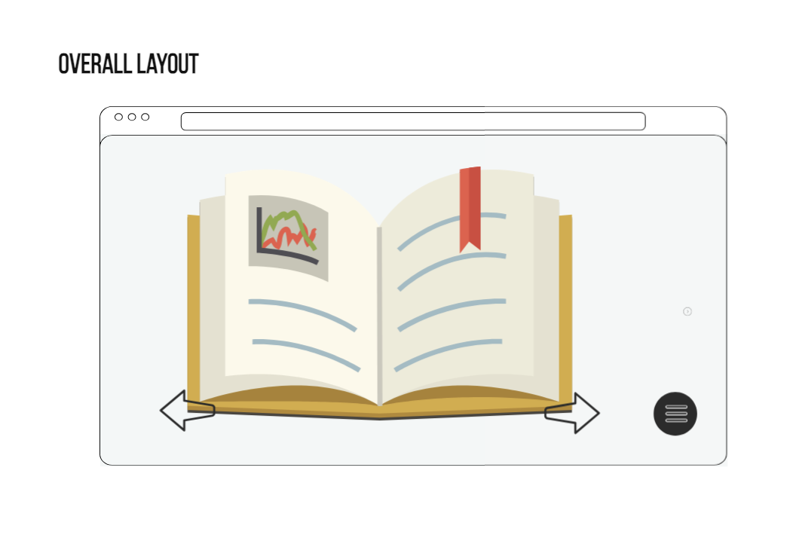
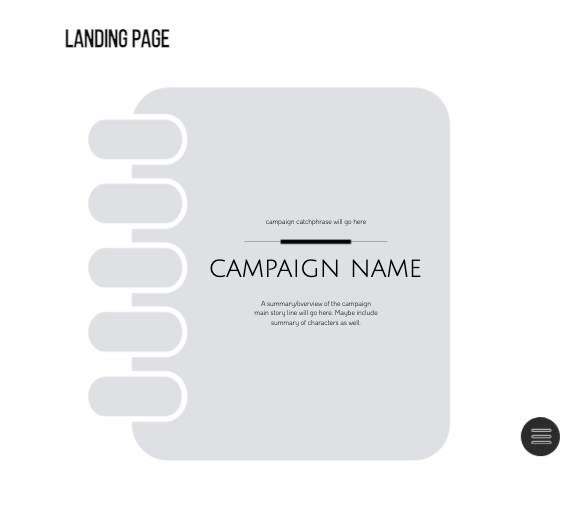
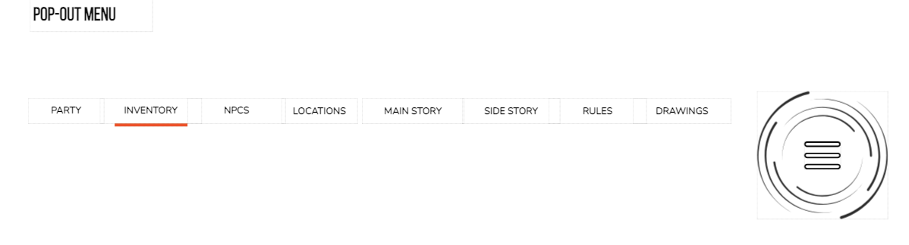
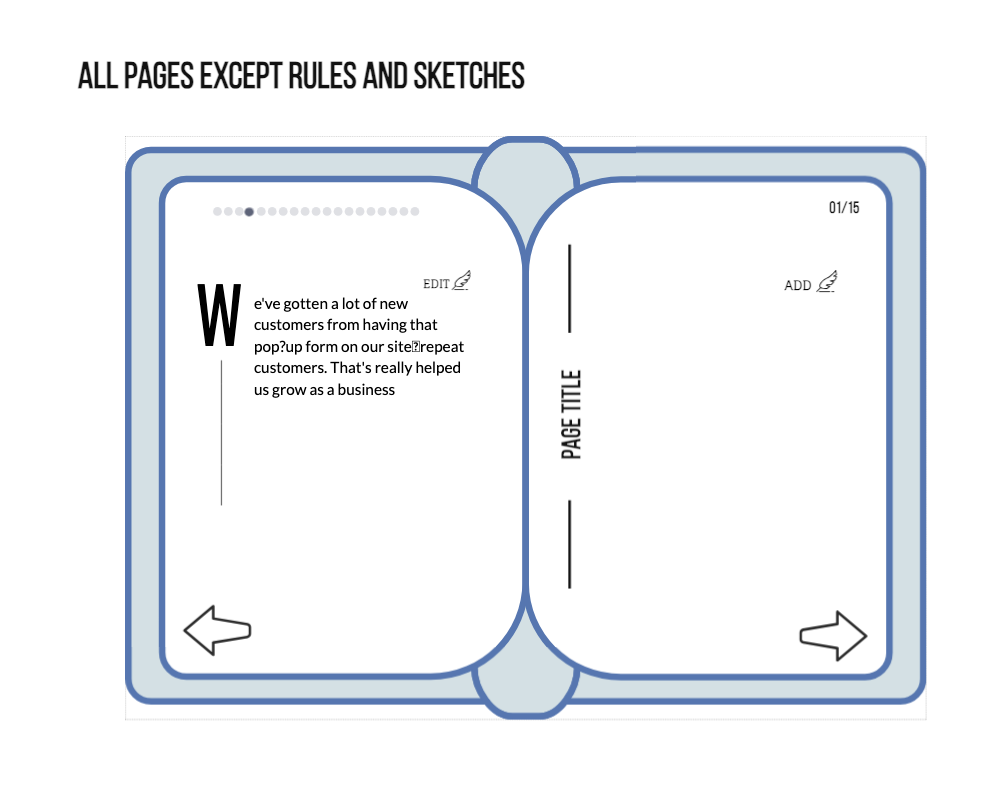
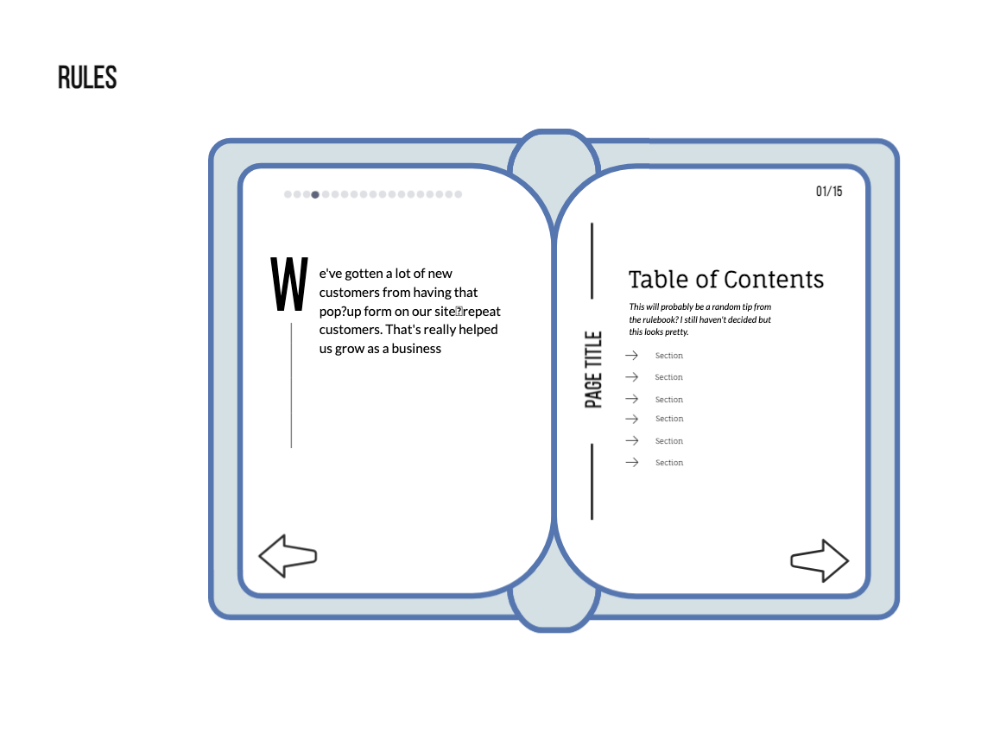
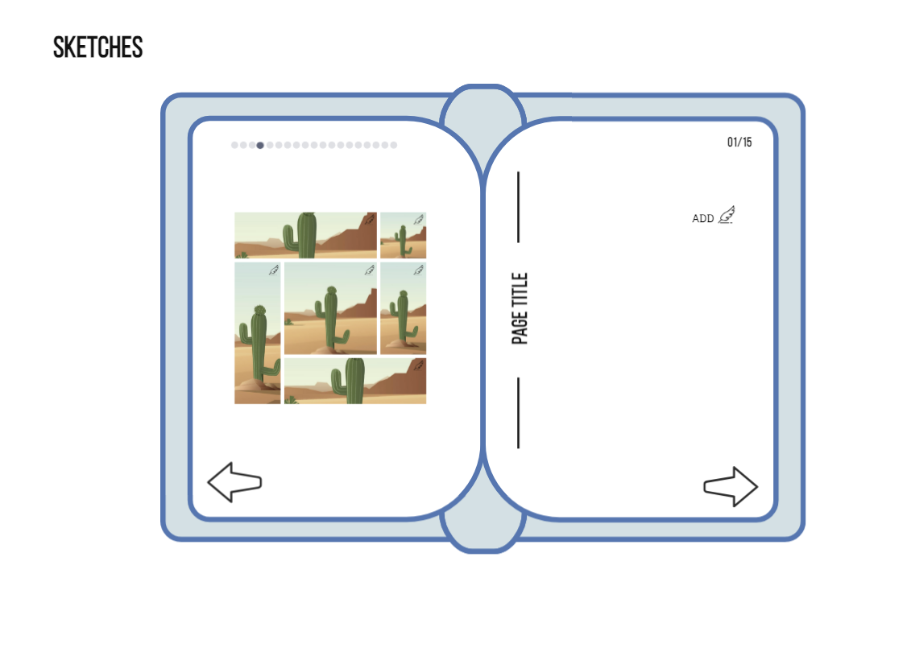

<div align="center">

  <!-- Add badges using the following format: -->
  <!-- (urlToGithubHere) -->

[](https://opensource.org/licenses/MIT)
[](https://github.com/404pandas/campaign-notebook/graphs/contributors)
[](https://github.com/404pandas/campaign-notebook/network/members)
[](https://github.com/404pandas/campaign-notebook/stargazers)
[](https://github.com/404pandas/campaign-notebook/issues)
[](https://linkedin.com/in/404pandas)

</div>

<!-- PROJECT LOGO -->

<div align="center">
  <a href="https://github.com/404pandas/campaign-notebook">
    
  </a>
  <hr>
  <h2>Dungeons & Dragons Campaign Notebook</h2>
  <a href="https://github.com/404pandas/campaign-notebook"><strong>Explore the docs »</strong></a>
  <br />
  <a href="https://404pandas.github.io/campaign-notebook/">View Demo</a>
  ·
  <a href="https://github.com/404pandas/campaign-notebook/issues">Report Bug</a>
  ·
  <a href="https://github.com/404pandas/campaign-notebook/issues">Request Feature</a>

</div>

<!-- TABLE OF CONTENTS -->
<details>
  <summary>Table of Contents</summary>
  <ol>
    <li>
      <a href="#about-the-project">About The Project</a>
      <ul>
        <li><a href="#built-with">Built With</a></li>
      </ul>
    </li>
    <li>
      <a href="#getting-started">Getting Started</a>
      <ul>
        <li><a href="#installation">Installation</a></li>
      </ul>
    </li>
    <li><a href="#usage">Usage</a></li>
    <li><a href="#roadmap">Roadmap</a></li>
    <li><a href="#contributing">Contributing</a></li>
    <li><a href="#license">License</a></li>
    <li><a href="#contact">Contact</a></li>
    <li><a href="#acknowledgments">Acknowledgments</a></li>
  </ol>
</details>

<!-- ABOUT THE PROJECT -->

## About The Project

<!-- Add screenshots using the following format: -->
<!--  -->

This project will initially be build with html, css, and javascript to show a build process to students in the UCF Full Stack Coding Bootcamp. Once back end is introduced to students, will add Postgres. Once MERN is introduced to the students, will convert and deploy as a PERN app.

### Built With

<div align="center">

[](https://javascript.info/)
[](https://html.com/)
[](https://developer.mozilla.org/en-US/docs/Web/CSS)
[](https://materializecss.com/)
[](https://mui.com/)
[](https://day.js.org/)
[](https://www.postgresql.org/)
[](https://expressjs.com/)
[](https://reactjs.org/docs/getting-started.html)
[](https://nodejs.org/en/)
[](https://render.com/)
[](https://www.npmjs.com/)
[](https://code.visualstudio.com/docs)

</div>

<!-- GETTING STARTED -->

## Getting Started

Once completely built, this application will function as a deployed app on Render

### Local Installation / Testing

If you would like you clone and test this app locally, please follow these instructions:

1. Clone the rep

```
git clone https://github.com/404pandas/campaign-notebook.git
```

2. Install dependencies

```
npm run install
```

3. Seed the database

```
npm run seed
```

4. Launch the app in development environments

```
npm run develop
```

5. Visit:

[localhost]()

```

```

<!-- USAGE EXAMPLES -->

## Usage

Once the app is functional, screenshots will be added in this section.

<!-- ROADMAP -->

## Roadmap

#### MVP

- [ ] Front End

  - [ ] General Layout

    - [x] HTML Skeleton
    - [ ] Book
    - [ ] Tabs
      - [ ] Arrows
      - [ ] Discs
    - [ ] Pop Out Menu
    - [ ] Add button
    - [ ] Edit button
    - [ ] Vertical Page title
    - [ ] Font

  - [ ] Party
  - [ ] Inventory
  - [ ] NPCs
  - [ ] Locations
  - [ ] Main Story
  - [ ] Side Story
  - [ ] Rules
  - [ ] Drawings

#### Future Development

- [ ] Back End
  - [ ] Users
  - [ ] Campaigns viewable by others

### Wireframes

[Click here for the visme wireframe used for the images below](https://my.visme.co/view/6x3d06g6-dnd-note-taking-app)

<div align="center">

<br>
<br>
<br>
<br>
<br>


</div>

See the [open issues](https://github.com/404pandas/campaign-notebook/issues) for a full list of proposed features (and known issues).

<!-- CONTRIBUTING -->

## Contributing

Contributions are what make the open source community such an amazing place to learn, inspire, and create. Any contributions you make are **greatly appreciated**.

If you have a suggestion that would make this better, please fork the repo and create a pull request. You can also simply open an issue with the tag "enhancement".
Don't forget to give the project a star! Thanks again!

1. Fork the Project
2. Create your Feature Branch (git checkout -b feature/AmazingFeature)
3. Commit your Changes (git commit -m 'Add some AmazingFeature')
4. Push to the Branch (git push origin feature/AmazingFeature)
5. Open a Pull Request

<!-- LICENSE -->

## License

For now, this project is licensed under the MIT license. Please be respectful of my hard work and give me credit if you use my code.

See LICENSE.txt for more information.

<!-- CONTACT -->

## Contact

[Mary Elenius](https://maryelenius.com/d20) - mary.panda.jackson@gmail.com

Project Links:

[Wireframe](https://my.visme.co/view/6x3d06g6-dnd-note-taking-app)

[Github Repository](https://github.com/404pandas/campaign-notebook)

[Deployment](https://404pandas.github.io/campaign-notebook/)

<!-- ACKNOWLEDGMENTS -->

## Acknowledgments

I would like to give a big shoutout to my partner in crime and daughter, Yennefer! Every day she proves she is small yet mighty!

This app was built with heavy usage of [D&D 5e API
](https://www.dnd5eapi.co/), the 5th Edition Dungeons and Dragons API. It is a simple api for things within the Official 5th Edition SRD and easily accessible through a modern RESTful API.
